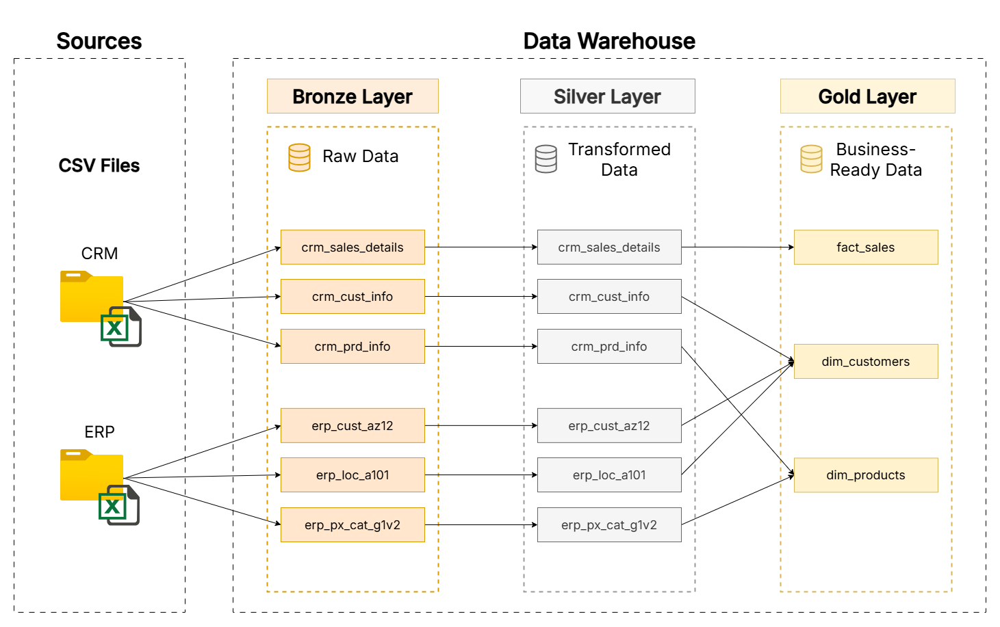

# SQL Data Warehouse

## Project Overview
This is a data warehouse built on Microsoft SQL Server using the **Medallion architecture** (Bronze → Silver → Gold). The data warehouse integrates data from two (2) source systems: CRM and ERP, and delivers a business-ready data model, structured as a star schema.

## Data Architecture


Data flows through three layers:

| Layer      | Purpose                                                                                                                                        |
| ---------- | ---------------------------------------------------------------------------------------------------------------------------------------------- |
| **Bronze** | Raw data ingested as-is from source CSV files via `BULK INSERT`. No transformations done.                                                      |
| **Silver** | Transformed, cleaned, and standardized data. Includes but not limited to deduplication, type casting, null handling, and values normalization. |
| **Gold**   | Business-ready semantic model structured as a star schema, built as SQL views.                                                                 |

### Data Flow


## Data Model


The gold layer is structured a star schema with three (3) tables:
- `gold.fact_sales`: transactional sales data at the order line item level.
- `gold.dim_customers`: customer identity and demographics.
- `gold.dim_products`: product attributes and categorization (current records only).

Surrogate keys were generated with `ROW_NUMBER()` and used as join keys, keeping the data model independent from source system identifiers.

## Data Quality & Documentation
- **Naming conventions:** documented standards for schemas, tablesm, views, columns, stored procedures, and column keys across all layers ([docs/naming_conventions.md](docs/naming_conventions.md)).
- **Data dictionary:** column-level descriptions, data types, and keys for all gold layer tables ([docs/data_dictionary.md](docs/data_dictionary.md)).
- **Traceability:** natural keys from source systems were retained alongside surrogate keys to support lineage and auditability.

### Silver Layer Transformations
The silver layer stored procedure (`scripts/silver/proc_load_silver.sql`) applies the following cleaning and transformation rules:

- **Deduplication:** for the customer data, kept the most recent customer record when duplicates exist, using `ROW_NUMBER()` partitioned by customer ID.
- **Whitespace trimming:** stripped leading/trailing spaces from all string fields.
- **Category standardization:** expanded abbreviated codes to readable labels: gender (`F` → `Female`), marital status (`S` → `Single`), product lines (`R` → `Road`, `M` → `Mountain`, etc.), and country codes (`DE` → `Germany`, `US` → `United States`).
- **Date validation:** — invalid date values (zero or wrong format) and future dates were set to `NULL`
- **Financial metric cross-validation** — sales amount was recalculated as `quantity * price` when the original value is null, zero, or inconsistent with the business logic.
- **Product history handling:** product end dates wree derived using the `LEAD()` window function; only current records (no end date) were included in the gold layer.
- **ID normalization:** removed formatting characters from source IDs (e.g., dashes, prefixes) to ensure consistent joins across systems.

## Repository Structure
```
sql-data-warehouse/
│
├── assets/
│   └── data_architecture.png       → Architecture diagram
│   └── data_model.png              → Star schema data model diagram
│
├── data/
│   ├── source_crm/                 → CRM source files (CSV)
│   │   ├── cust_info.csv
│   │   ├── prd_info.csv
│   │   └── sales_details.csv
│   └── source_erp/                 → ERP source files (CSV)
│       ├── CUST_AZ12.csv
│       ├── LOC_A101.csv
│       └── PX_CAT_G1V2.csv
│
├── docs/
│   ├── data_dictionary.md          → Column-level definitions for the gold layer
│   └── naming_conventions.md       → Naming standards for all objects
│
├── scripts/
│   ├── init_database.sql           → Creates the database and schemas
│   ├── bronze/
│   │   ├── ddl_bronze.sql          → Table definitions for the bronze layer
│   │   └── proc_load_bronze.sql    → Stored procedure: load raw data from CSV
│   ├── silver/
│   │   └── proc_load_silver.sql    → Stored procedure: clean and transform data
│   └── gold/
│       └── ddl_gold.sql            → View definitions for the star schema
│
└── README.md
```

---

## How to Run
> Requires Microsoft SQL Server and access to the source CSV files.

1. Run `scripts/init_database.sql` to create the `DataWarehouse` database and schemas.
2. Run `scripts/bronze/ddl_bronze.sql` to create the bronze tables.
3. Update the file paths in `scripts/bronze/proc_load_bronze.sql` to match your local environment, then execute it to create and run the stored procedure.
4. Run `scripts/silver/proc_load_silver.sql` to create and execute the load stored procedure in the silver layer.
5. Run `scripts/gold/ddl_gold.sql` to create the views in the gold layer.
